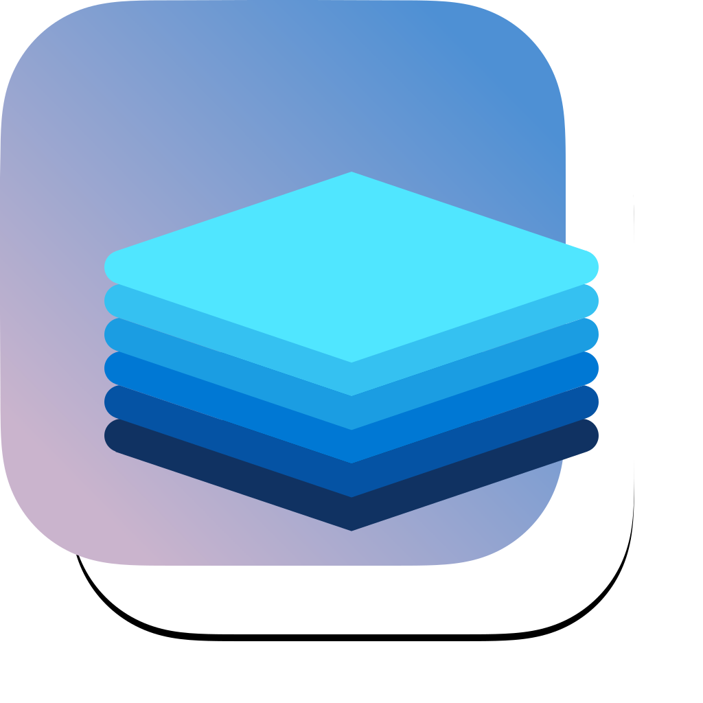
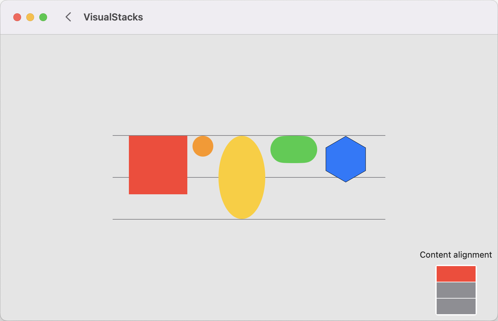

  

    
    
    

# VisualStacks
Demonstrates how to use SwiftUI StackViews in various and frequently encountered situations.

  

## More information
This is a companion repository for the Medium article: [Master SwiftUI StackViews: Visual Guide](https://blog.eclypse.io/master-swiftui-stackviews-visual-guide-2394eaa91564). Please refer to the blog for more information.

## Requirements

| XCode | 15.4 |
|:----------|:----------|
| Swift | 5 |

